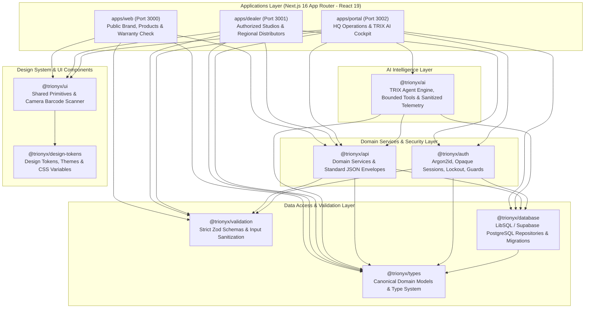
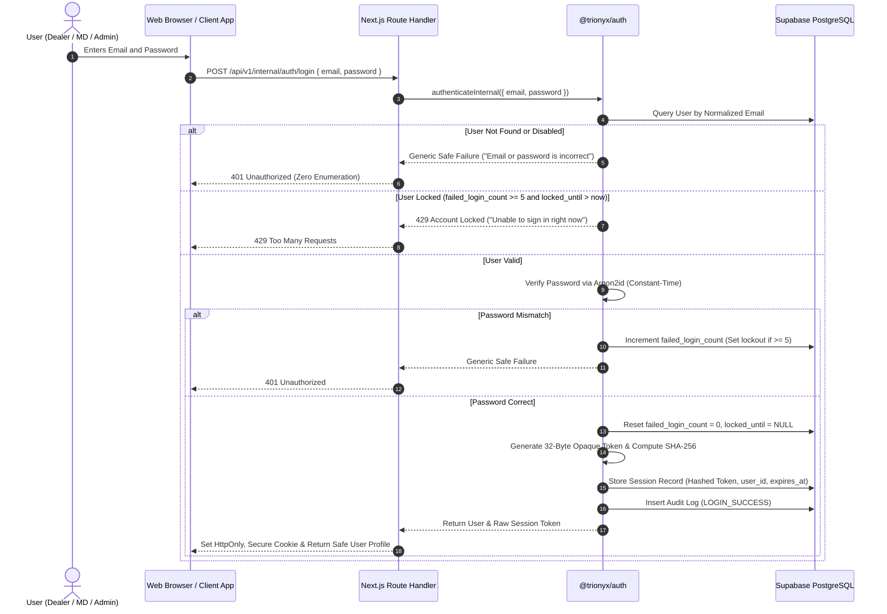
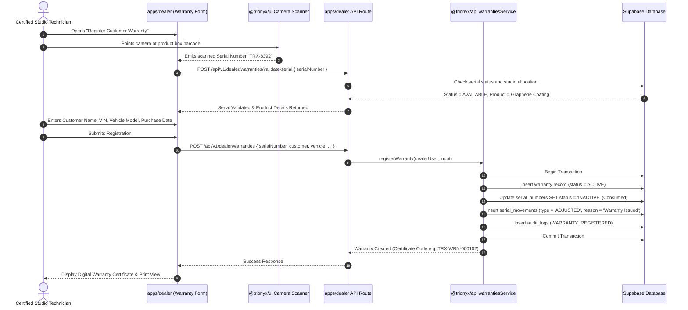
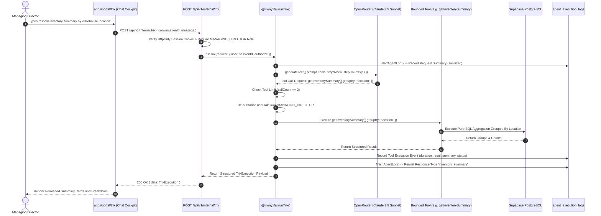
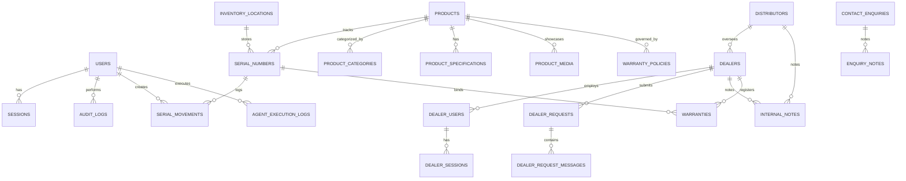

# Trionyx Monorepo — Complete Architecture Blueprint & Project File Tree

**Platform:** Trionyx — Premium Automotive Surface Protection Ecosystem  
**Architecture Style:** Modular Monorepo (Turborepo + pnpm workspaces)  
**Apps:** 3 Next.js 16 Applications (`web`, `dealer`, `portal`)  
**Shared Packages:** 10 Independent TypeScript Packages  
**Database:** Dual-Target (Supabase PostgreSQL in Production / LibSQL SQLite in Testing)  
**Security:** Argon2id, SHA-256 Opaque Sessions, 5-Attempt Lockout, Zero-Enumeration  
**Intelligence:** TRIX Managing Director AI Agent (Vercel AI SDK, OpenRouter, Claude 3.5 Sonnet)  
**Date:** October 2026  

---

## 1. Executive Overview & Business Domain

Trionyx is an enterprise automotive surface protection platform that coordinates manufacturing, physical serial ledger tracking, studio distribution, customer warranty certification, and executive intelligence.

The operational universe encompasses four foundational surfaces:
1. **Public Brand Authority (`apps/web`)**: High-end consumer experience showcasing advanced surface technologies (Graphene, Borophene, Ceramic, and Paint Protection Film - PPF), certified studio directories, inbound lead capture, and public customer warranty validation.
2. **Certified Studio & Dealer Workspace (`apps/dealer`)**: Secured operational portal for authorized detailing studios and regional distributors. Detailing studios use this to check live stock availability without exposing stockpile depths, issue digital warranty certificates with camera barcode scanning, and raise inventory allocation requests. Regional distributors monitor allocated studio networks and manage fulfillment.
3. **Internal Headquarters Command Cockpit (`apps/portal`)**: Operations cockpit for Trionyx management, administrators, and the Managing Director. Staff manage master product catalogs, execute batch serial number intake, transfer inventory between physical warehouses, govern warranties, triage inquiries, and review audit trails.
4. **TRIX Executive AI Intelligence (`packages/ai` & `apps/portal/trix`)**: An AI agent built for the Managing Director. Grounded in real operational data, TRIX executes bounded, read-only analytical queries across serial history, inventory aggregations, warehouse transfers, and deterministic exception conditions.

---

## 2. Complete Monorepo System Architecture



---

## 3. Full Project File Tree

The complete project file tree (850+ project files, excluding `node_modules`, `.next`, `.turbo`, and build caches):

```text
trionyx/
├── apps
│   ├── dealer
│   │   ├── public
│   │   │   ├── brand
│   │   │   │   └── trionyx-logo-dark.png
│   │   │   └── icons
│   │   │       ├── account.svg
│   │   │       ├── availability.svg
│   │   │       ├── dealers.svg
│   │   │       ├── guide.svg
│   │   │       ├── overview.svg
│   │   │       ├── products.svg
│   │   │       ├── requests.svg
│   │   │       ├── signout.svg
│   │   │       └── warranty.svg
│   │   ├── src
│   │   │   ├── app
│   │   │   │   ├── account
│   │   │   │   │   ├── AccountView.tsx
│   │   │   │   │   ├── DistributorAccountView.tsx
│   │   │   │   │   └── page.tsx
│   │   │   │   ├── activate
│   │   │   │   │   ├── ActivateForm.tsx
│   │   │   │   │   └── page.tsx
│   │   │   │   ├── api
│   │   │   │   │   ├── auth
│   │   │   │   │   │   ├── activate
│   │   │   │   │   │   │   └── route.ts
│   │   │   │   │   │   ├── forgot-password
│   │   │   │   │   │   │   └── route.ts
│   │   │   │   │   │   ├── login
│   │   │   │   │   │   │   └── route.ts
│   │   │   │   │   │   ├── logout
│   │   │   │   │   │   │   └── route.ts
│   │   │   │   │   │   ├── me
│   │   │   │   │   │   │   └── route.ts
│   │   │   │   │   │   └── reset-password
│   │   │   │   │   │       └── route.ts
│   │   │   │   │   ├── dealer
│   │   │   │   │   │   ├── account
│   │   │   │   │   │   │   ├── password
│   │   │   │   │   │   │   │   └── route.ts
│   │   │   │   │   │   │   └── route.ts
│   │   │   │   │   │   ├── availability
│   │   │   │   │   │   │   └── route.ts
│   │   │   │   │   │   ├── overview
│   │   │   │   │   │   │   └── route.ts
│   │   │   │   │   │   ├── products
│   │   │   │   │   │   │   ├── [id]
│   │   │   │   │   │   │   │   └── route.ts
│   │   │   │   │   │   │   └── route.ts
│   │   │   │   │   │   └── requests
│   │   │   │   │   │       ├── [id]
│   │   │   │   │   │       │   ├── messages
│   │   │   │   │   │       │   │   └── route.ts
│   │   │   │   │   │       │   └── route.ts
│   │   │   │   │   │       └── route.ts
│   │   │   │   │   └── v1
│   │   │   │   │       └── dealer
│   │   │   │   │           ├── account
│   │   │   │   │           │   ├── password
│   │   │   │   │           │   │   └── route.ts
│   │   │   │   │           │   └── route.ts
│   │   │   │   │           ├── auth
│   │   │   │   │           │   ├── activate
│   │   │   │   │           │   │   └── route.ts
│   │   │   │   │           │   ├── forgot-password
│   │   │   │   │           │   │   └── route.ts
│   │   │   │   │           │   ├── login
│   │   │   │   │           │   │   └── route.ts
│   │   │   │   │           │   ├── logout
│   │   │   │   │           │   │   └── route.ts
│   │   │   │   │           │   ├── reset-password
│   │   │   │   │           │   │   └── route.ts
│   │   │   │   │           │   └── session
│   │   │   │   │           │       └── route.ts
│   │   │   │   │           ├── availability
│   │   │   │   │           │   └── route.ts
│   │   │   │   │           ├── overview
│   │   │   │   │           │   └── route.ts
│   │   │   │   │           ├── products
│   │   │   │   │           │   ├── [productId]
│   │   │   │   │           │   │   └── route.ts
│   │   │   │   │           │   └── route.ts
│   │   │   │   │           ├── requests
│   │   │   │   │           │   ├── [requestId]
│   │   │   │   │           │   │   ├── messages
│   │   │   │   │           │   │   │   └── route.ts
│   │   │   │   │           │   │   └── route.ts
│   │   │   │   │           │   └── route.ts
│   │   │   │   │           └── warranties
│   │   │   │   │               ├── [warrantyId]
│   │   │   │   │               │   └── route.ts
│   │   │   │   │               ├── validate-serial
│   │   │   │   │               │   └── route.ts
│   │   │   │   │               └── route.ts
│   │   │   │   ├── availability
│   │   │   │   │   ├── AvailabilityView.tsx
│   │   │   │   │   └── page.tsx
│   │   │   │   ├── dealers
│   │   │   │   │   ├── DealersView.tsx
│   │   │   │   │   └── page.tsx
│   │   │   │   ├── forgot-password
│   │   │   │   │   └── page.tsx
│   │   │   │   ├── guide
│   │   │   │   │   ├── DistributorGuideView.tsx
│   │   │   │   │   └── page.tsx
│   │   │   │   ├── login
│   │   │   │   │   ├── LoginForm.tsx
│   │   │   │   │   └── page.tsx
│   │   │   │   ├── overview
│   │   │   │   │   ├── OverviewView.tsx
│   │   │   │   │   └── page.tsx
│   │   │   │   ├── products
│   │   │   │   │   ├── [productId]
│   │   │   │   │   │   ├── page.tsx
│   │   │   │   │   │   └── ProductDetailView.tsx
│   │   │   │   │   ├── page.tsx
│   │   │   │   │   └── ProductsView.tsx
│   │   │   │   ├── requests
│   │   │   │   │   ├── [requestId]
│   │   │   │   │   │   ├── page.tsx
│   │   │   │   │   │   └── RequestDetailView.tsx
│   │   │   │   │   ├── new
│   │   │   │   │   │   ├── NewRequestForm.tsx
│   │   │   │   │   │   └── page.tsx
│   │   │   │   │   ├── page.tsx
│   │   │   │   │   └── RequestsView.tsx
│   │   │   │   ├── reset-password
│   │   │   │   │   └── page.tsx
│   │   │   │   ├── warranty
│   │   │   │   │   ├── page.tsx
│   │   │   │   │   └── WarrantyView.tsx
│   │   │   │   ├── globals.css
│   │   │   │   ├── layout.tsx
│   │   │   │   └── page.tsx
│   │   │   ├── components
│   │   │   │   ├── shell
│   │   │   │   │   └── DealerShell.tsx
│   │   │   │   └── ui
│   │   │   │       └── MaskIcon.tsx
│   │   │   ├── lib
│   │   │   │   ├── auth.ts
│   │   │   │   └── format.ts
│   │   │   └── middleware.ts
│   │   ├── .env
│   │   ├── .env.local
│   │   ├── AGENTS.md
│   │   ├── CLAUDE.md
│   │   ├── eslint.config.mjs
│   │   ├── next-env.d.ts
│   │   ├── next.config.ts
│   │   ├── package.json
│   │   ├── postcss.config.mjs
│   │   ├── tsconfig.json
│   │   ├── USER_GUIDE.md
│   │   └── vercel.json
│   ├── portal
│   │   ├── public
│   │   │   └── brand
│   │   │       ├── trionyx-logo-dark.png
│   │   │       ├── trionyx-logo-light.png
│   │   │       └── TrionyxOpsMark.svg
│   │   ├── src
│   │   │   ├── app
│   │   │   │   ├── api
│   │   │   │   │   ├── auth
│   │   │   │   │   │   ├── login
│   │   │   │   │   │   │   └── route.ts
│   │   │   │   │   │   ├── logout
│   │   │   │   │   │   │   └── route.ts
│   │   │   │   │   │   └── me
│   │   │   │   │   │       └── route.ts
│   │   │   │   │   ├── categories
│   │   │   │   │   │   └── route.ts
│   │   │   │   │   ├── dealers
│   │   │   │   │   │   ├── [id]
│   │   │   │   │   │   │   ├── history
│   │   │   │   │   │   │   │   └── route.ts
│   │   │   │   │   │   │   ├── notes
│   │   │   │   │   │   │   │   └── route.ts
│   │   │   │   │   │   │   ├── reassign
│   │   │   │   │   │   │   │   └── route.ts
│   │   │   │   │   │   │   ├── requests
│   │   │   │   │   │   │   │   ├── [requestId]
│   │   │   │   │   │   │   │   │   └── route.ts
│   │   │   │   │   │   │   │   └── route.ts
│   │   │   │   │   │   │   ├── status
│   │   │   │   │   │   │   │   └── route.ts
│   │   │   │   │   │   │   ├── users
│   │   │   │   │   │   │   │   ├── invite
│   │   │   │   │   │   │   │   │   └── route.ts
│   │   │   │   │   │   │   │   └── route.ts
│   │   │   │   │   │   │   └── route.ts
│   │   │   │   │   │   └── route.ts
│   │   │   │   │   ├── distributors
│   │   │   │   │   │   ├── [id]
│   │   │   │   │   │   │   ├── notes
│   │   │   │   │   │   │   │   └── route.ts
│   │   │   │   │   │   │   ├── status
│   │   │   │   │   │   │   │   └── route.ts
│   │   │   │   │   │   │   └── route.ts
│   │   │   │   │   │   └── route.ts
│   │   │   │   │   ├── inventory
│   │   │   │   │   │   ├── adjust
│   │   │   │   │   │   │   └── route.ts
│   │   │   │   │   │   ├── locations
│   │   │   │   │   │   │   └── route.ts
│   │   │   │   │   │   ├── receive
│   │   │   │   │   │   │   └── route.ts
│   │   │   │   │   │   ├── serials
│   │   │   │   │   │   │   └── lookup
│   │   │   │   │   │   │       └── route.ts
│   │   │   │   │   │   └── transfer
│   │   │   │   │   │       └── route.ts
│   │   │   │   │   ├── media
│   │   │   │   │   │   └── [id]
│   │   │   │   │   │       └── route.ts
│   │   │   │   │   ├── products
│   │   │   │   │   │   ├── [id]
│   │   │   │   │   │   │   ├── archive
│   │   │   │   │   │   │   │   └── route.ts
│   │   │   │   │   │   │   └── route.ts
│   │   │   │   │   │   └── route.ts
│   │   │   │   │   ├── upload
│   │   │   │   │   │   └── route.ts
│   │   │   │   │   └── v1
│   │   │   │   │       └── internal
│   │   │   │   │           ├── auth
│   │   │   │   │           │   ├── login
│   │   │   │   │           │   │   └── route.ts
│   │   │   │   │           │   ├── logout
│   │   │   │   │           │   │   └── route.ts
│   │   │   │   │           │   └── session
│   │   │   │   │           │       └── route.ts
│   │   │   │   │           ├── dealer-requests
│   │   │   │   │           │   └── [requestId]
│   │   │   │   │           │       └── route.ts
│   │   │   │   │           ├── dealer-users
│   │   │   │   │           │   └── [dealerUserId]
│   │   │   │   │           │       └── disable
│   │   │   │   │           │           └── route.ts
│   │   │   │   │           ├── dealers
│   │   │   │   │           │   ├── [dealerId]
│   │   │   │   │           │   │   ├── assign-distributor
│   │   │   │   │           │   │   │   └── route.ts
│   │   │   │   │           │   │   ├── history
│   │   │   │   │           │   │   │   └── route.ts
│   │   │   │   │           │   │   ├── notes
│   │   │   │   │           │   │   │   └── route.ts
│   │   │   │   │           │   │   ├── requests
│   │   │   │   │           │   │   │   ├── [requestId]
│   │   │   │   │           │   │   │   │   └── route.ts
│   │   │   │   │           │   │   │   └── route.ts
│   │   │   │   │           │   │   ├── status
│   │   │   │   │           │   │   │   └── route.ts
│   │   │   │   │           │   │   ├── users
│   │   │   │   │           │   │   │   ├── invite
│   │   │   │   │           │   │   │   │   └── route.ts
│   │   │   │   │           │   │   │   └── route.ts
│   │   │   │   │           │   │   └── route.ts
│   │   │   │   │           │   └── route.ts
│   │   │   │   │           ├── distributors
│   │   │   │   │           │   ├── [distributorId]
│   │   │   │   │           │   │   ├── dealers
│   │   │   │   │           │   │   │   └── route.ts
│   │   │   │   │           │   │   ├── notes
│   │   │   │   │           │   │   │   └── route.ts
│   │   │   │   │           │   │   ├── status
│   │   │   │   │           │   │   │   └── route.ts
│   │   │   │   │           │   │   └── route.ts
│   │   │   │   │           │   └── route.ts
│   │   │   │   │           ├── enquiries
│   │   │   │   │           │   ├── [enquiryId]
│   │   │   │   │           │   │   ├── assign
│   │   │   │   │           │   │   │   └── route.ts
│   │   │   │   │           │   │   ├── notes
│   │   │   │   │           │   │   │   └── route.ts
│   │   │   │   │           │   │   ├── status
│   │   │   │   │           │   │   │   └── route.ts
│   │   │   │   │           │   │   └── route.ts
│   │   │   │   │           │   └── route.ts
│   │   │   │   │           ├── inventory
│   │   │   │   │           │   ├── adjust
│   │   │   │   │           │   │   └── route.ts
│   │   │   │   │           │   ├── locations
│   │   │   │   │           │   │   ├── [locationId]
│   │   │   │   │           │   │   │   └── route.ts
│   │   │   │   │           │   │   └── route.ts
│   │   │   │   │           │   ├── movements
│   │   │   │   │           │   │   └── route.ts
│   │   │   │   │           │   ├── receive
│   │   │   │   │           │   │   └── route.ts
│   │   │   │   │           │   ├── serials
│   │   │   │   │           │   │   ├── [serialNumber]
│   │   │   │   │           │   │   │   └── route.ts
│   │   │   │   │           │   │   └── route.ts
│   │   │   │   │           │   ├── transfer
│   │   │   │   │           │   │   └── route.ts
│   │   │   │   │           │   └── route.ts
│   │   │   │   │           ├── media
│   │   │   │   │           │   ├── [mediaId]
│   │   │   │   │           │   │   └── route.ts
│   │   │   │   │           │   └── upload
│   │   │   │   │           │       └── route.ts
│   │   │   │   │           ├── overview
│   │   │   │   │           │   └── route.ts
│   │   │   │   │           ├── product-categories
│   │   │   │   │           │   ├── [categoryId]
│   │   │   │   │           │   │   └── route.ts
│   │   │   │   │           │   └── route.ts
│   │   │   │   │           ├── products
│   │   │   │   │           │   ├── [productId]
│   │   │   │   │           │   │   ├── archive
│   │   │   │   │           │   │   │   └── route.ts
│   │   │   │   │           │   │   ├── restore
│   │   │   │   │           │   │   │   └── route.ts
│   │   │   │   │           │   │   ├── warranty-policy
│   │   │   │   │           │   │   │   └── route.ts
│   │   │   │   │           │   │   └── route.ts
│   │   │   │   │           │   └── route.ts
│   │   │   │   │           ├── trix
│   │   │   │   │           │   └── route.ts
│   │   │   │   │           └── warranties
│   │   │   │   │               ├── [warrantyId]
│   │   │   │   │               │   ├── void
│   │   │   │   │               │   │   └── route.ts
│   │   │   │   │               │   └── route.ts
│   │   │   │   │               ├── validate-serial
│   │   │   │   │               │   └── route.ts
│   │   │   │   │               └── route.ts
│   │   │   │   ├── dealers
│   │   │   │   │   ├── [dealerId]
│   │   │   │   │   │   ├── edit
│   │   │   │   │   │   │   └── page.tsx
│   │   │   │   │   │   ├── DealerDetailView.tsx
│   │   │   │   │   │   └── page.tsx
│   │   │   │   │   ├── new
│   │   │   │   │   │   └── page.tsx
│   │   │   │   │   ├── DealerEmptyState.tsx
│   │   │   │   │   ├── DealerForm.tsx
│   │   │   │   │   ├── DealersTable.tsx
│   │   │   │   │   └── page.tsx
│   │   │   │   ├── distributors
│   │   │   │   │   ├── [distributorId]
│   │   │   │   │   │   ├── edit
│   │   │   │   │   │   │   └── page.tsx
│   │   │   │   │   │   ├── DistributorDetailView.tsx
│   │   │   │   │   │   └── page.tsx
│   │   │   │   │   ├── new
│   │   │   │   │   │   └── page.tsx
│   │   │   │   │   ├── DistributorEmptyState.tsx
│   │   │   │   │   ├── DistributorForm.tsx
│   │   │   │   │   ├── DistributorsTable.tsx
│   │   │   │   │   └── page.tsx
│   │   │   │   ├── enquiries
│   │   │   │   │   ├── [enquiryId]
│   │   │   │   │   │   ├── EnquiryDetailView.tsx
│   │   │   │   │   │   └── page.tsx
│   │   │   │   │   ├── EnquiriesTable.tsx
│   │   │   │   │   ├── EnquiryEmptyState.tsx
│   │   │   │   │   └── page.tsx
│   │   │   │   ├── guide
│   │   │   │   │   ├── page.tsx
│   │   │   │   │   └── PortalGuideView.tsx
│   │   │   │   ├── inventory
│   │   │   │   │   ├── locations
│   │   │   │   │   │   ├── LocationsTable.tsx
│   │   │   │   │   │   └── page.tsx
│   │   │   │   │   ├── movements
│   │   │   │   │   │   ├── MovementsTable.tsx
│   │   │   │   │   │   └── page.tsx
│   │   │   │   │   ├── serials
│   │   │   │   │   │   └── [serialId]
│   │   │   │   │   │       ├── page.tsx
│   │   │   │   │   │       └── SerialRecordView.tsx
│   │   │   │   │   ├── InventoryTable.tsx
│   │   │   │   │   └── page.tsx
│   │   │   │   ├── login
│   │   │   │   │   └── page.tsx
│   │   │   │   ├── overview
│   │   │   │   │   ├── error.tsx
│   │   │   │   │   ├── loading.tsx
│   │   │   │   │   ├── OverviewCockpit.tsx
│   │   │   │   │   ├── page.tsx
│   │   │   │   │   ├── QueueEmptyIllustration.tsx
│   │   │   │   │   ├── SignOutButton.tsx
│   │   │   │   │   └── StockAvailableIllustration.tsx
│   │   │   │   ├── products
│   │   │   │   │   ├── [productId]
│   │   │   │   │   │   ├── edit
│   │   │   │   │   │   │   └── page.tsx
│   │   │   │   │   │   ├── page.tsx
│   │   │   │   │   │   └── ProductDetailView.tsx
│   │   │   │   │   ├── new
│   │   │   │   │   │   └── page.tsx
│   │   │   │   │   ├── page.tsx
│   │   │   │   │   ├── ProductEmptyState.tsx
│   │   │   │   │   ├── ProductForm.tsx
│   │   │   │   │   └── ProductsTable.tsx
│   │   │   │   ├── settings
│   │   │   │   │   └── appearance
│   │   │   │   │       ├── AppearanceSettings.tsx
│   │   │   │   │       └── page.tsx
│   │   │   │   ├── trix
│   │   │   │   │   ├── page.tsx
│   │   │   │   │   ├── TrixConversation.module.css
│   │   │   │   │   └── TrixConversation.tsx
│   │   │   │   ├── warranty
│   │   │   │   │   ├── [warrantyId]
│   │   │   │   │   │   ├── page.tsx
│   │   │   │   │   │   └── WarrantyDetailView.tsx
│   │   │   │   │   ├── page.tsx
│   │   │   │   │   ├── WarrantyEmptyIllustration.tsx
│   │   │   │   │   └── WarrantyListView.tsx
│   │   │   │   ├── appearance.css
│   │   │   │   ├── favicon.ico
│   │   │   │   ├── globals.css
│   │   │   │   ├── layout.tsx
│   │   │   │   └── page.tsx
│   │   │   ├── components
│   │   │   │   ├── inventory
│   │   │   │   │   ├── ReceiveStockModal.tsx
│   │   │   │   │   └── SerialNumberLookupModal.tsx
│   │   │   │   ├── shell
│   │   │   │   │   ├── InternalShell.tsx
│   │   │   │   │   ├── MobileNavigation.tsx
│   │   │   │   │   ├── OperationsIcons.tsx
│   │   │   │   │   ├── Sidebar.tsx
│   │   │   │   │   ├── theme-init-script.ts
│   │   │   │   │   ├── theme-utils.test.ts
│   │   │   │   │   ├── theme-utils.ts
│   │   │   │   │   ├── ThemeProvider.tsx
│   │   │   │   │   └── UserMenu.tsx
│   │   │   │   ├── ui
│   │   │   │   │   ├── ConfirmDialog.tsx
│   │   │   │   │   └── Modal.tsx
│   │   │   │   └── workspace
│   │   │   │       ├── ActivityLedger.tsx
│   │   │   │       ├── AttentionQueue.tsx
│   │   │   │       ├── EmptyOperationalState.tsx
│   │   │   │       ├── EmptyState.tsx
│   │   │   │       ├── index.ts
│   │   │   │       ├── OperationalSummary.tsx
│   │   │   │       ├── OperationalSummaryStrip.tsx
│   │   │   │       ├── RecordSection.tsx
│   │   │   │       ├── RegistryToolbar.tsx
│   │   │   │       ├── StatusBadge.tsx
│   │   │   │       ├── WorkspaceHeader.tsx
│   │   │   │       ├── WorkspaceSidebar.tsx
│   │   │   │       └── WorkspaceViewsProvider.tsx
│   │   │   └── middleware.ts
│   │   ├── .env
│   │   ├── .env.local
│   │   ├── AGENTS.md
│   │   ├── CLAUDE.md
│   │   ├── eslint.config.mjs
│   │   ├── next-env.d.ts
│   │   ├── next.config.ts
│   │   ├── package.json
│   │   ├── postcss.config.mjs
│   │   ├── tsconfig.json
│   │   ├── USER_GUIDE.md
│   │   └── vercel.json
│   └── web
│       ├── public
│       │   ├── brand
│       │   │   ├── trionyx-logo-dark.png
│       │   │   ├── trionyx-logo-light.png
│       │   │   └── TrionyxOpsMark.svg
│       │   ├── images
│       │   │   ├── about
│       │   │   │   ├── ceramic-coating-surface.jpg
│       │   │   │   ├── installation.jpg
│       │   │   │   ├── ppf-installation.jpg
│       │   │   │   └── surface.jpg
│       │   │   ├── borophene
│       │   │   │   └── borophene-surface.jpg
│       │   │   ├── contact
│       │   │   │   ├── enquiry-received.png
│       │   │   │   └── README.md
│       │   │   ├── dealer
│       │   │   │   └── coating-surface.png
│       │   │   ├── graphene
│       │   │   │   └── mountain-bridge-cars.png
│       │   │   ├── hero
│       │   │   │   ├── graphene-protected-vehicle.png
│       │   │   │   └── vehicle-surface-experiment.png
│       │   │   └── warranty
│       │   │       ├── protection-car-prompt.md
│       │   │       ├── protection-car.png
│       │   │       └── serial-number-guide.jpg
│       │   ├── file.svg
│       │   ├── globe.svg
│       │   ├── next.svg
│       │   ├── trionyx-logo-orange.png
│       │   ├── trionyx-logo.png
│       │   ├── trionyx-materials.png
│       │   ├── vercel.svg
│       │   └── window.svg
│       ├── src
│       │   ├── app
│       │   │   ├── api
│       │   │   │   └── v1
│       │   │   │       └── public
│       │   │   │           ├── contact-enquiries
│       │   │   │           │   └── route.ts
│       │   │   │           └── warranty
│       │   │   │               └── check
│       │   │   │                   └── route.ts
│       │   │   ├── contact
│       │   │   │   └── page.tsx
│       │   │   ├── cookies
│       │   │   │   └── page.tsx
│       │   │   ├── dealer-access
│       │   │   │   ├── dealer-access.module.css
│       │   │   │   └── page.tsx
│       │   │   ├── design-system
│       │   │   │   └── page.tsx
│       │   │   ├── privacy
│       │   │   │   └── page.tsx
│       │   │   ├── products
│       │   │   │   └── [slug]
│       │   │   ├── terms
│       │   │   │   └── page.tsx
│       │   │   ├── warranty
│       │   │   │   └── page.tsx
│       │   │   ├── favicon.ico
│       │   │   ├── globals.css
│       │   │   ├── layout.tsx
│       │   │   └── page.tsx
│       │   ├── components
│       │   │   ├── about
│       │   │   │   ├── AboutSection.tsx
│       │   │   │   └── index.ts
│       │   │   ├── cards
│       │   │   │   └── index.tsx
│       │   │   ├── contact
│       │   │   │   ├── ContactForm.tsx
│       │   │   │   ├── ContactSuccess.module.css
│       │   │   │   ├── ContactSuccess.tsx
│       │   │   │   └── index.ts
│       │   │   ├── faq
│       │   │   │   ├── FAQSection.module.css
│       │   │   │   └── FAQSection.tsx
│       │   │   ├── feedback
│       │   │   │   └── index.tsx
│       │   │   ├── footer
│       │   │   │   └── SiteFooter.tsx
│       │   │   ├── frame
│       │   │   │   ├── ContentGrid.tsx
│       │   │   │   ├── index.ts
│       │   │   │   ├── PageFrame.tsx
│       │   │   │   └── SectionFrame.tsx
│       │   │   ├── graphene
│       │   │   │   ├── GrapheneSection.module.css
│       │   │   │   └── GrapheneSection.tsx
│       │   │   ├── header
│       │   │   │   ├── HeaderShell.tsx
│       │   │   │   └── ProductsMegaMenu.tsx
│       │   │   ├── hero
│       │   │   │   ├── AutomotiveRevealExperiment.module.css
│       │   │   │   ├── AutomotiveRevealExperiment.tsx
│       │   │   │   ├── HeroSection.tsx
│       │   │   │   ├── MeshGradientCanvas.module.css
│       │   │   │   └── MeshGradientCanvas.tsx
│       │   │   ├── legal
│       │   │   │   └── LegalPageShell.tsx
│       │   │   ├── mobile
│       │   │   ├── navigation
│       │   │   │   └── index.tsx
│       │   │   ├── network
│       │   │   │   ├── dottedMapData.ts
│       │   │   │   ├── index.ts
│       │   │   │   ├── IndiaNetworkMap.tsx
│       │   │   │   ├── NetworkSection.tsx
│       │   │   │   ├── worldMapData.ts
│       │   │   │   └── WorldNetworkMap.tsx
│       │   │   ├── product
│       │   │   │   └── index.tsx
│       │   │   ├── reviews
│       │   │   │   ├── index.ts
│       │   │   │   ├── ReviewsSection.module.css
│       │   │   │   └── ReviewsSection.tsx
│       │   │   ├── story
│       │   │   │   ├── BrandStory.module.css
│       │   │   │   └── BrandStory.tsx
│       │   │   ├── trust
│       │   │   │   ├── index.ts
│       │   │   │   ├── WhyTrionyxSection.module.css
│       │   │   │   └── WhyTrionyxSection.tsx
│       │   │   ├── ui
│       │   │   │   ├── Badge.tsx
│       │   │   │   ├── Button.tsx
│       │   │   │   ├── demo.tsx
│       │   │   │   ├── Forms.tsx
│       │   │   │   ├── Icons.tsx
│       │   │   │   ├── SectionEyebrow.tsx
│       │   │   │   ├── testimonial.tsx
│       │   │   │   ├── timeline-animation.tsx
│       │   │   │   ├── TrionyxLogo.tsx
│       │   │   │   ├── Typography.tsx
│       │   │   │   └── world-map.tsx
│       │   │   └── warranty
│       │   │       └── WarrantyCheckForm.tsx
│       │   ├── data
│       │   │   └── companyContact.ts
│       │   └── tokens
│       │       └── index.ts
│       ├── .env
│       ├── .env.local
│       ├── AGENTS.md
│       ├── CLAUDE.md
│       ├── eslint.config.mjs
│       ├── next-env.d.ts
│       ├── next.config.ts
│       ├── package.json
│       ├── postcss.config.mjs
│       ├── tsconfig.json
│       └── vercel.json
├── docs
│   ├── trix
│   │   ├── PHASE-01-ARCHITECTURE.md
│   │   ├── PHASE-02-INVENTORY-BACKEND-REPORT.md
│   │   ├── PHASE-03-ARCHITECTURE.md
│   │   └── TRIX-01-FOUNDATION.md
│   ├── 01-PROJECT-OVERVIEW.md
│   ├── 02-BUSINESS-CONTEXT.md
│   ├── 03-PROJECT-SCOPE.md
│   ├── 04-INFORMATION-ARCHITECTURE.md
│   ├── 05-CONTENT-SOURCE-OF-TRUTH.md
│   ├── 06-DESIGN-LANGUAGE.md
│   ├── 07-DESIGN-SYSTEM.md
│   ├── 08-RESPONSIVE-RULES.md
│   ├── 09-COMPONENT-SYSTEM.md
│   ├── 10-IMAGE-AND-MEDIA-RULES.md
│   ├── 11-FRONTEND-ARCHITECTURE.md
│   ├── 12-BACKEND-ARCHITECTURE.md
│   ├── 13-AUTH-ROLES-PERMISSIONS.md
│   ├── 14-DATA-MODEL.md
│   ├── 15-INTEGRATIONS.md
│   ├── 16-DEPLOYMENT.md
│   ├── 17-SEO-AEO-GEO.md
│   ├── 18-ACCESSIBILITY-PERFORMANCE.md
│   ├── 19-QA-ACCEPTANCE.md
│   ├── 20-AGENT-RULES.md
│   ├── 21-OPERATIONS-ICON-SYSTEM.md
│   ├── PRODUCT-CLAIMS-TO-VERIFY.md
│   └── README.md
├── packages
│   ├── ai
│   │   ├── src
│   │   │   ├── __tests__
│   │   │   │   ├── trix-phase02.test.ts
│   │   │   │   └── trix.test.ts
│   │   │   ├── logging
│   │   │   │   └── agent-log.ts
│   │   │   ├── responses
│   │   │   │   ├── dealer-network.ts
│   │   │   │   └── schema.ts
│   │   │   ├── tools
│   │   │   │   ├── dealer-network.ts
│   │   │   │   ├── inventory-exceptions.ts
│   │   │   │   ├── inventory-summary.ts
│   │   │   │   ├── lookup-serial.ts
│   │   │   │   ├── resolvers.ts
│   │   │   │   ├── search-inventory.ts
│   │   │   │   └── serial-movements.ts
│   │   │   ├── index.ts
│   │   │   ├── provider.ts
│   │   │   └── trix-agent.ts
│   │   ├── package.json
│   │   └── tsconfig.json
│   ├── api
│   │   ├── src
│   │   │   ├── client
│   │   │   │   └── index.ts
│   │   │   ├── services
│   │   │   │   ├── contactEnquiries.ts
│   │   │   │   ├── dealerAuth.ts
│   │   │   │   ├── dealerNetwork.ts
│   │   │   │   ├── dealerPortal.ts
│   │   │   │   ├── dealerRequests.ts
│   │   │   │   ├── dealers.ts
│   │   │   │   ├── distributors.ts
│   │   │   │   ├── internalAuth.ts
│   │   │   │   ├── internalOverview.ts
│   │   │   │   ├── inventory.ts
│   │   │   │   ├── products.ts
│   │   │   │   └── warranties.ts
│   │   │   ├── index.ts
│   │   │   └── response.ts
│   │   ├── package.json
│   │   └── tsconfig.json
│   ├── auth
│   │   ├── src
│   │   │   ├── __tests__
│   │   │   │   ├── authentication.test.ts
│   │   │   │   ├── dealer-portal.test.ts
│   │   │   │   ├── dealers-distributors.test.ts
│   │   │   │   ├── overview.test.ts
│   │   │   │   ├── password.test.ts
│   │   │   │   ├── products-inventory.test.ts
│   │   │   │   ├── roles.test.ts
│   │   │   │   ├── security.test.ts
│   │   │   │   ├── session.test.ts
│   │   │   │   └── validation.test.ts
│   │   │   ├── authenticate.ts
│   │   │   ├── config.ts
│   │   │   ├── crypto.ts
│   │   │   ├── dealerAuth.ts
│   │   │   ├── distributorAuth.ts
│   │   │   ├── guards.ts
│   │   │   ├── index.ts
│   │   │   ├── lockout.ts
│   │   │   ├── overview.ts
│   │   │   └── session.ts
│   │   ├── package.json
│   │   └── tsconfig.json
│   ├── config
│   │   ├── package.json
│   │   └── tsconfig.base.json
│   ├── database
│   │   ├── migrations
│   │   │   ├── 0001_initial_auth_schema.sql
│   │   │   ├── 0002_products_and_inventory.sql
│   │   │   ├── 0003_serial_number_inventory.sql
│   │   │   ├── 0004_dealers_distributors.sql
│   │   │   ├── 0012_trix_execution_logs.sql
│   │   │   └── 0013_trix_dealer_network_logs.sql
│   │   ├── src
│   │   │   ├── repositories
│   │   │   │   ├── agentLogs.ts
│   │   │   │   ├── audit.ts
│   │   │   │   ├── categories.ts
│   │   │   │   ├── contactEnquiries.ts
│   │   │   │   ├── dealerNetwork.ts
│   │   │   │   ├── dealerRequestMessages.ts
│   │   │   │   ├── dealerRequests.ts
│   │   │   │   ├── dealers.ts
│   │   │   │   ├── dealerSessions.ts
│   │   │   │   ├── dealerUsers.ts
│   │   │   │   ├── distributors.ts
│   │   │   │   ├── enquiryNotes.ts
│   │   │   │   ├── internalNotes.ts
│   │   │   │   ├── locations.ts
│   │   │   │   ├── media.ts
│   │   │   │   ├── products.ts
│   │   │   │   ├── serialMovements.ts
│   │   │   │   ├── serials.ts
│   │   │   │   ├── sessions.ts
│   │   │   │   ├── specifications.ts
│   │   │   │   ├── users.ts
│   │   │   │   ├── warranties.ts
│   │   │   │   └── warrantyPolicies.ts
│   │   │   ├── agentLogMigration.ts
│   │   │   ├── agentLogSchema.ts
│   │   │   ├── db.ts
│   │   │   ├── index.ts
│   │   │   ├── postgresSchema.ts
│   │   │   ├── storage.ts
│   │   │   ├── supabase_schema.sql
│   │   │   └── supabase_seed_admins.sql
│   │   ├── package.json
│   │   └── tsconfig.json
│   ├── design-tokens
│   │   ├── src
│   │   │   ├── index.ts
│   │   │   └── theme.css
│   │   ├── package.json
│   │   └── tsconfig.json
│   ├── eslint-config
│   │   ├── index.js
│   │   └── package.json
│   ├── types
│   │   ├── src
│   │   │   └── index.ts
│   │   ├── package.json
│   │   └── tsconfig.json
│   ├── ui
│   │   ├── src
│   │   │   ├── scanner
│   │   │   │   ├── CameraScannerModal.tsx
│   │   │   │   ├── feedback.ts
│   │   │   │   ├── index.ts
│   │   │   │   ├── types.ts
│   │   │   │   └── useBarcodeScanner.ts
│   │   │   ├── Badge.tsx
│   │   │   ├── Button.tsx
│   │   │   ├── Forms.tsx
│   │   │   ├── Icons.tsx
│   │   │   ├── index.ts
│   │   │   ├── TrionyxLogo.tsx
│   │   │   ├── TrionyxOpsMark.tsx
│   │   │   └── Typography.tsx
│   │   ├── package.json
│   │   └── tsconfig.json
│   └── validation
│       ├── src
│       │   └── index.ts
│       ├── package.json
│       └── tsconfig.json
├── qa
│   ├── cloth-frame-a.png
│   ├── cloth-frame-b.png
│   ├── layers-desktop.png
│   ├── layers-mobile.png
│   ├── ribbon-desktop.png
│   ├── ribbon-mobile.png
│   ├── stripe-live-reference.png
│   ├── trust-desktop.png
│   └── trust-mobile-lower.png
├── scripts
│   ├── audit-auth-db.ts
│   ├── backup-db.ts
│   ├── clean-test-fixtures.ts
│   ├── create-internal-user.ts
│   ├── create-suresh-credentials.ts
│   ├── extract_brand_logo.py
│   ├── generate_dotted_data.mjs
│   ├── generate-tree-report.cjs
│   ├── migrate-sqlite-to-supabase.ts
│   ├── provision-distributor-and-users.ts
│   ├── restore-db.ts
│   ├── seed-official-studios.ts
│   └── test-distributor-isolation.ts
├── svg
│   ├── dyn-ad2a9da1ae71822a21c49fdb17ef94cc 1 [Vectorized].svg
│   ├── dyn-f5aa6d695126f774ca4e1c64072a38dd 1 [Vectorized].svg
│   ├── image 452 [Vectorized].svg
│   ├── mess.svg
│   ├── Unknown-2 1 [Vectorized].svg
│   └── Unknown-3 1 [Vectorized].svg
├── .env
├── .env.example
├── .env.local
├── .gitignore
├── AGENTS.md
├── bun.lock
├── Caddyfile
├── CLAUDE.md
├── DEPLOYMENT.md
├── design-qa.md
├── docker-compose.yml
├── Dockerfile
├── ecosystem.config.cjs
├── next-env.d.ts
├── package.json
├── pill.png
├── pnpm-lock.yaml
├── pnpm-workspace.yaml
├── PROJECT_STRUCTURE.md
├── README.md
├── stripe-reference.html
├── ta.png
├── tabel.png
├── tsconfig.json
└── turbo.json
```

---

## 4. Applications Architecture Deep Dive

### 4.1 `apps/web` — Public Website
- **Technology**: Next.js 16, React 19, Tailwind CSS v4, Motion.
- **Port**: 3000
- **Purpose**: Brand authority, consumer education, installer network locator, warranty validation, and lead acquisition.
- **Key Architecture Decisions**:
  - **Server-First Composition**: Layouts, typography, and content grids remain Server Components for sub-second First Contentful Paint (FCP) and optimal SEO/AEO indexing.
  - **Client Islands**: Interactive elements (`MeshGradientCanvas`, `IndiaNetworkMap`, `WarrantyCheckForm`, `ContactForm`) are strictly isolated with `'use client'`.
  - **Honeypot Bot Trap**: Contact form includes an invisible `website` field and in-memory IP rate limiting to stop spam bots without hurting user experience.
- **Key Routes**:
  - `/`: Animated brand hero, automotive reveal canvas, technology overview, trust pillars, interactive network map.
  - `/products/[slug]`: Detailed dynamic product pages for Graphene, Borophene, Ceramic, and PPF.
  - `/warranty`: Public customer warranty lookup by serial number or vehicle VIN.
  - `/contact`: Multi-lingual friendly customer and dealership enquiry intake.
  - `/dealer-access`: Gateway directing detailing studios to the dealer portal.
- **Public API Route Handlers**:
  - `POST /api/v1/public/contact-enquiries`: Public inquiry submission with rate limiting and bot trap.
  - `POST /api/v1/public/warranty/check`: Safe public warranty check returning sanitized customer verification details.

---

### 4.2 `apps/dealer` — Dealer & Distributor Portal
- **Technology**: Next.js 16, React 19, Tailwind CSS v4, @trionyx/ui.
- **Port**: 3001
- **Purpose**: Secure operational interface for certified studios and regional distributors.
- **Key Architecture Decisions**:
  - **Activation Lifecycle**: New studios receive an invitation token, verify business details, and set an Argon2id password via `/activate`.
  - **Availability Masking**: Detailing studios view inventory availability as a threshold indicator (e.g. `>10 units in stock`) rather than raw warehouse quantities, protecting Trionyx supply-chain data while ensuring studios know items can be ordered.
  - **Camera Hardware Scanner**: Studio technicians can scan physical product QR/barcodes directly using their smartphone/laptop camera via `CameraScannerModal` in `@trionyx/ui` to register warranties without manual typing.
  - **Multi-Tenant Scoping**: Detailing studios can only access warranties and requests created by their own studio ID. Regional distributors see aggregated metrics and requests across all studios in their assigned territory.
- **Key Routes**:
  - `/login` & `/activate`: Studio authentication and invitation onboarding.
  - `/overview`: Operational dashboard displaying active warranties, pending requests, and stock alerts.
  - `/availability`: Live product stock catalog with availability status badges.
  - `/warranty`: Customer warranty issuance with serial validation, camera scanner, and customer record management.
  - `/requests`: Multi-threaded allocation requests with bidirectional messaging.
  - `/dealers`: Distributor-only registry showing assigned studios and regional metrics.
  - `/guide`: Trilingual (English, Hindi, Telugu) dealer and distributor operational manual.

---

### 4.3 `apps/portal` — Headquarters Operations & TRIX AI Cockpit
- **Technology**: Next.js 16, React 19, Turbopack, Tailwind CSS v4.
- **Port**: 3002
- **Purpose**: Central command and control center for Trionyx headquarters staff, admins, and the Managing Director.
- **Key Architecture Decisions**:
  - **Role Separation**: Unified login screen with zero role hints; the server securely checks the database record to enforce permissions for `ADMIN`, `MANAGING_DIRECTOR`, and `DISTRIBUTOR`.
  - **Physical Serial Ledger**: Comprehensive tracking of manufactured physical units from batch intake, to warehouse transfers, to studio allocation, to warranty voiding.
  - **TRIX AI Cockpit**: Dedicated executive intelligence workspace where the Managing Director queries inventory and anomalies in natural language.
- **Key Routes**:
  - `/overview`: Executive cockpit showing live available inventory, active dealer count, and real-time audit ledger.
  - `/inventory`: Physical serial registry, batch intake modal, warehouse transfer workflow, location manager, and movement history.
  - `/products`: Master catalog CRUD, specifications manager, media upload, and warranty policy assignments.
  - `/dealers` & `/distributors`: Studio network directory, distributor assignments, invitation generation, and credential resets.
  - `/warranty`: Global warranty registry, certificate lookup, and void management with required audit reasons.
  - `/enquiries`: Inbound customer lead triage and notes timeline.
  - `/trix`: Conversational AI workspace for the Managing Director.
- **Internal API Route Handlers**:
  - `POST /api/v1/internal/auth/login`: Secure internal credential verification.
  - `POST /api/v1/internal/trix`: TRIX AI agent invocation endpoint (restricted to `MANAGING_DIRECTOR`).
  - `POST /api/v1/internal/inventory/receive`: Batch intake of new physical serial numbers.
  - `POST /api/v1/internal/inventory/transfer`: Stock movement between inventory locations.
  - `POST /api/v1/internal/inventory/adjust`: Status changes with mandatory audit trail reasons.

---

## 5. Shared Packages Architecture Deep Dive

### 5.1 `@trionyx/types` — Canonical Domain Types
- Central type definitions exported across the entire monorepo.
- **Enums**:
  - `UserRole`: `'ADMIN' | 'MANAGING_DIRECTOR' | 'DISTRIBUTOR' | 'DEALER' | 'STAFF'`
  - `UserStatus`: `'ACTIVE' | 'SUSPENDED' | 'PENDING_VERIFICATION' | 'DISABLED'`
  - `SerialStatus`: `'AVAILABLE' | 'TRANSFERRED' | 'INACTIVE'`
  - `SerialMovementType`: `'RECEIVED' | 'TRANSFERRED' | 'ADJUSTED'`
  - `WarrantyStatus`: `'ACTIVE' | 'EXPIRED' | 'VOIDED'`
  - `ContactEnquiryType`: `'PRODUCT_ENQUIRY' | 'DEALER_ENQUIRY' | 'DISTRIBUTION_ENQUIRY' | 'PRODUCT_SUPPORT' | 'GENERAL_ENQUIRY'`
  - `ContactEnquiryStatus`: `'NEW' | 'REVIEWED' | 'RESPONDED' | 'CLOSED'`
- **Interfaces**: `SafeUser`, `Product`, `SerialNumberWithDetails`, `SerialMovementWithDetails`, `InventoryLocation`, `Warranty`, `Dealer`, `Distributor`, `ContactEnquiry`.

### 5.2 `@trionyx/validation` — Strict Schema Validation
- Built with Zod to enforce strict boundary validation on all inputs.
- Normalized email transformations (trimming and lowercasing).
- Schemas for authentication (`loginSchema`, `createInternalUserSchema`), inventory operations (`receiveSerialsSchema`, `transferSerialsSchema`, `adjustSerialStatusSchema`), warranties (`registerWarrantySchema`, `voidWarrantySchema`), and public inquiries (`createContactEnquirySchema`).

### 5.3 `@trionyx/database` — Database & Repository Layer
- **Dual Runtime Support**: Uses `@libsql/client` to support both SQLite (in-memory test suites and local fixtures) and Supabase PostgreSQL (production connection pooling) transparently.
- **Repositories**:
  - `serialsRepository`: Single lookup, paginated filtered list with correlated subqueries for `last_movement_at`, pure SQL aggregations (`getInventorySummary`), and deterministic exception rules (`getInventoryExceptions`).
  - `serialMovementsRepository`: Ledger recording with date range filtering (`fromDate`, `toDate`) and actor details.
  - `productsRepository`: Product CRUD, specification links, and fuzzy/exact name matching (`findMatching`).
  - `locationsRepository`: Warehouse locations, status management, and code matching (`findMatching`).
  - `dealersRepository` & `distributorsRepository`: Studio hierarchies, reassignment audit trail, notes.
  - `warrantiesRepository`: Warranty registration, VIN indexing, customer lookup, and void management.
  - `agentLogsRepository`: Sanitized execution logs and tool event persistence in `agent_execution_logs`.
  - `auditRepository`: Immutable system-wide audit event ledger.

### 5.4 `@trionyx/auth` — Security & Session Subsystem
- **Argon2id Password Hashing**: Implemented via `@node-rs/argon2` using RFC 9106 recommended parameters (19 MiB memory, 2 iterations, 1 parallelism).
- **Constant-Time Verification**: Prevents timing side-channel attacks during password evaluation.
- **Brute-Force Lockout**: 5 failed login attempts trigger an automatic 15-minute account lockout (`locked_until`).
- **Zero Account Enumeration**: Consistent generic error responses regardless of whether the user exists, is locked, or provided an incorrect password.
- **Opaque Sessions**: 32-byte cryptographically secure random session tokens stored as SHA-256 hashes in the database. Cookies are transmitted with `HttpOnly`, `Secure`, `SameSite: Lax`.
- **Role Guards**: `requireRole`, `requireInternalUser`, `requireDealerUser` enforce strict authorization on every server request.

### 5.5 `@trionyx/api` — Domain Services & HTTP Responses
- Standardized API envelope wrappers:
  - `apiSuccess(data, status = 200, headers?)` -> `{ data }`
  - `apiCollection(data, meta, status = 200, headers?)` -> `{ data, meta: { page, pageSize, total } }`
  - `apiError(code, message, status = 400, details?)` -> `{ error: { code, message, details } }`
- Orchestrates high-level business services: `inventoryService`, `dealerPortalService`, `warrantiesService`, `contactEnquiriesService`, `dealersService`, `distributorsService`.

### 5.6 `@trionyx/ai` — TRIX Intelligence Engine
- **Engine**: Vercel AI SDK (`ai` v4.3) with OpenRouter provider (`createOpenAICompatible`) defaulting to `anthropic/claude-3.5-sonnet`.
- **Managing Director Guard**: Runtime `assertManagingDirector(user)` authorization check on request intake, context authorization, and within each tool execution hook.
- **Read-Only Invariant**: Contains zero write, create, or mutation tools. Mutation attempts ("delete serial", "adjust stock") are safely blocked without tool execution.
- **Bound Execution**: Bounded by `stopWhen: stepCountIs(1)` and `calls <= 2` (`lookupSerial` isolated to 1 call per turn).
- **Injection Defense**: Rejects attempts to execute raw SQL, shell commands, or external web browsing.
- **Sanitized Telemetry**: Persists structured execution metadata to `agent_execution_logs` with zero leakage of session tokens, passwords, or raw serial dumps.
- **Registered Tools**:
  1. `lookupSerial`: Serial record inspection with lineage and movement history.
  2. `searchInventory`: Serial-level inventory filtering by query, product, location, or status.
  3. `getInventorySummary`: Pure SQL aggregations grouped by product, location, or status.
  4. `getRecentSerialMovements`: Movement history with date range filtering.
  5. `getInventoryExceptions`: Deterministic anomaly detection without invented thresholds:
     - `ZERO_AVAILABLE_STOCK` (`WARNING`): Active products with 0 available serials.
     - `INACTIVE_LOCATION_STOCK` (`CRITICAL`): Available serials in inactive warehouses.
     - `ORPHAN_SERIAL_LOCATION` (`CRITICAL`): Serials referencing missing location records.

### 5.7 `@trionyx/ui` — Design System & Hardware Scanner
- Shared React 19 UI component library.
- Primitives: `Button`, `Badge`, `Modal`, `ConfirmDialog`, `Typography`, `TrionyxLogo`, `TrionyxOpsMark`.
- **Camera Hardware Scanner**: `CameraScannerModal` and `useBarcodeScanner` use the browser's MediaDevices API to provide real-time hardware camera scanning of QR codes and 1D barcodes for serial verification and warranty registration.

### 5.8 `@trionyx/design-tokens` — Styling Tokens & Themes
- Global CSS custom properties for surfaces, borders, text hierarchy, and brand accents.
- Supports light, dark, and high-contrast operational modes.

---

## 6. Authentication & Security Flow



---

## 7. Operational Workflows & Sequence Diagrams

### 7.1 Warranty Registration & Physical Serial Consumption



---

### 7.2 TRIX AI Inventory Query Lifecycle



---

## 8. Database Entity Relationship Diagram



---

## 9. Deployment, Infrastructure & Network Topology

- **Public Web Application (`apps/web`)**:
  - Production URL: `https://trionyx.india.growxlabs.tech` (or `https://trionyx.in`)
  - Target: Vercel Edge / Node.js Runtime
- **Dealer Portal (`apps/dealer`)**:
  - Production URL: `https://dealer-trionyx.growxlabs.tech` (or `https://dealers.trionyx.in`)
  - Target: Vercel Node.js Runtime (Session cookies scoped to portal domain)
- **Headquarters Portal (`apps/portal`)**:
  - Production URL: `https://portal-trionyx.growxlabs.tech` (or `https://ops.trionyx.in`)
  - Target: Vercel Node.js Runtime (Private entrypoint, strict CORS and Origin matching)
- **Database Infrastructure**:
  - Production Engine: Supabase Managed PostgreSQL (AWS `ap-south-1` Mumbai region)
  - Connection Pooler: Transaction Pooler on port 6543 for serverless scale
  - Storage: Supabase S3-compatible storage bucket (`trionyx-media`) for media and technical datasheets
- **Local Multi-Port Setup**:
  - `apps/web`: `http://localhost:3000`
  - `apps/dealer`: `http://localhost:3001`
  - `apps/portal`: `http://localhost:3002`

---

## 10. Developer Commands & Tooling Guide

| Command | Scope | Description |
|---|---|---|
| `pnpm dev` | Monorepo | Spawns all three applications simultaneously on ports 3000, 3001, and 3002 |
| `pnpm turbo build` | Monorepo | Compiles and builds production bundles across all packages and apps |
| `pnpm turbo typecheck` | Monorepo | Runs TypeScript compiler (`tsc --noEmit`) across all 13 monorepo packages |
| `pnpm test` | Monorepo | Runs 50 platform test suites (auth, lockout, permissions, inventory, warranties) |
| `pnpm --filter @trionyx/ai test` | Package | Runs all 48 test suites for TRIX AI agent, tools, injection defense, and resolvers |
| `pnpm turbo lint` | Monorepo | Runs ESLint verification across workspaces |
| `tsx scripts/backup-db.ts` | Script | Creates a timestamped local backup of the database schema and records |
| `tsx scripts/seed-official-studios.ts` | Script | Seeds certified detailing studio records and initial product inventory |
